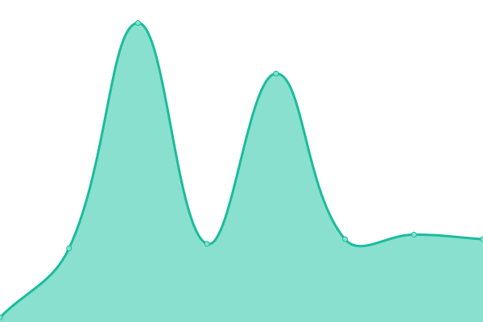

# [📈 Live Status](https://status.zeitvertreib.vip): <!--live status--> **🟧 Partial outage**

This repository contains the open-source uptime monitor and status page for [Alexander Betke](alexinabox.de), powered by [Upptime](https://github.com/upptime/upptime).

With [Upptime](https://upptime.js.org), you can get your own unlimited and free uptime monitor and status page, powered entirely by a GitHub repository. We use [Issues](https://github.com/alexinabox/status/issues) as incident reports, [Actions](https://github.com/alexinabox/status/actions) as uptime monitors, and [Pages](https://status.zeitvertreib.vip) for the status page.

<!--start: status pages-->
<!-- This summary is generated by Upptime (https://github.com/upptime/upptime) -->
<!-- Do not edit this manually, your changes will be overwritten -->
<!-- prettier-ignore -->
| URL | Status | History | Response Time | Uptime |
| --- | ------ | ------- | ------------- | ------ |
|  Confidence (DDoS Protection) | 🟩 Up | [confidence-d-do-s-protection.yml](https://github.com/AlexInABox/status/commits/HEAD/history/confidence-d-do-s-protection.yml) | 

 103ms
     
 | 

<a href="https://status.zeitvertreib.vip/history/confidence-d-do-s-protection">100.00%</a>
    

|  Bliss (Hetzner Dedicated Server) | 🟥 Down | [bliss-hetzner-dedicated-server.yml](https://github.com/AlexInABox/status/commits/HEAD/history/bliss-hetzner-dedicated-server.yml) | 

 110ms
     
 | 

<a href="https://status.zeitvertreib.vip/history/bliss-hetzner-dedicated-server">98.37%</a>
    

|  Curiosity (Las Vegas VPS) | 🟩 Up | [curiosity-las-vegas-vps.yml](https://github.com/AlexInABox/status/commits/HEAD/history/curiosity-las-vegas-vps.yml) | 

 58ms
     
 | 

<a href="https://status.zeitvertreib.vip/history/curiosity-las-vegas-vps">100.00%</a>
    

|  Base (Berlin VPS) | 🟩 Up | [base-berlin-vps.yml](https://github.com/AlexInABox/status/commits/HEAD/history/base-berlin-vps.yml) | 

 115ms
     
 | 

<a href="https://status.zeitvertreib.vip/history/base-berlin-vps">100.00%</a>
    

<!--end: status pages-->

[**Visit our status website →**](https://status.zeitvertreib.vip)

## 📄 License

- Powered by: [Upptime](https://github.com/upptime/upptime)
- Code: [MIT](./LICENSE) © [Anand Chowdhary](https://anandchowdhary.com), supported by [Pabio](https://pabio.com)
- Data in the `./history` directory: [Open Database License](https://opendatacommons.org/licenses/odbl/1-0/)
